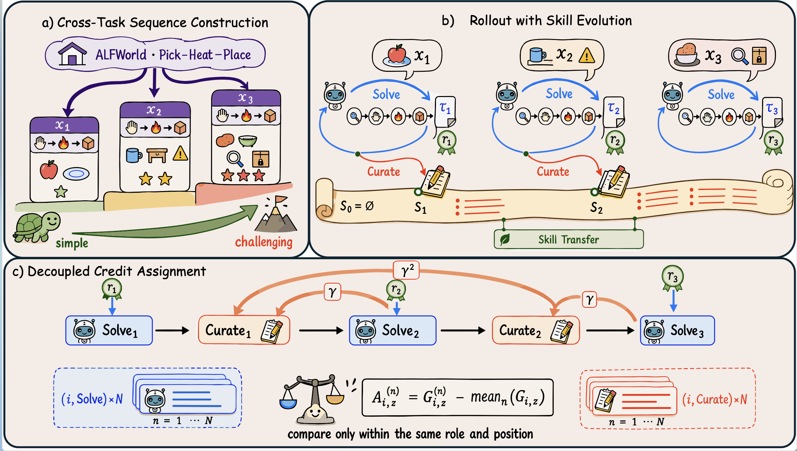
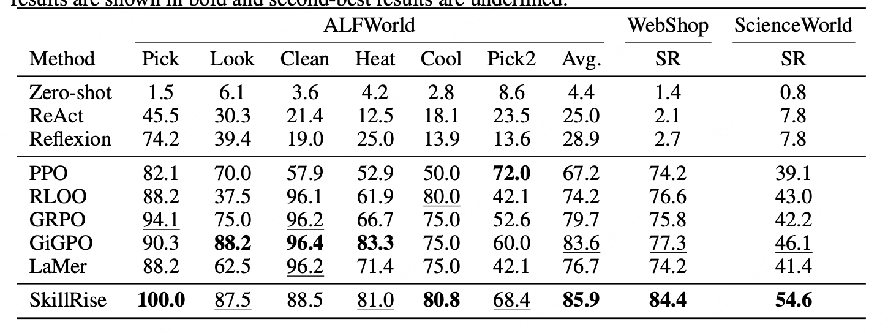

# SkillRise

**SkillRise** is an end-to-end reinforcement learning framework for cross-task
skill learning. A single policy plays an ordered sequence of related tasks,
alternating between **solving** the current task with an evolving skill document
and **curating** that document from the resulting trajectory before moving to the
next task. Evaluated on ALFWorld, WebShop, and ScienceWorld.

Thanks to [verl](https://github.com/volcengine/verl) and
[verl-agent (GiGPO)](https://github.com/langfengQ/verl-agent).

## Method



SkillRise (a) constructs progressively challenging task sequences from the same
task family, (b) rolls out a single policy that alternates Solve and Curate so the
skill document evolves and transfers across tasks, and (c) uses decoupled
cross-task credit assignment with group-relative advantages computed only within
the same role and position.

## Setup

```bash
pip install -r requirements.txt   # verl is vendored in verl/, no separate install
```

Environment backends:

- **ALFWorld** and **WebShop**: follow the
  [verl-agent](https://github.com/langfengQ/verl-agent) setup.
- **ScienceWorld**: follow the [BEACON](https://github.com/ZJU-REAL/BEACON) setup.

## Running

Edit `examples/<env>/env.sh` (set `SKILLRISE_MODEL_PATH`, data paths, `WANDB_API_KEY`),
then:

```bash
bash examples/skillrise_alfworld/skillrise_alfworld_qwen3_4b.sh   # SkillRise
bash examples/skillrise_alfworld/grpo_alfworld_qwen3_4b.sh        # GRPO baseline
```

Same layout for `skillrise_webshop/` and `skillrise_sciworld/`. Task sequences
are bundled under `data/groups/`.

## Results



SkillRise achieves the best overall results across ALFWorld, WebShop, and
ScienceWorld, outperforming prompting-based methods and RL baselines.

## License

Apache License 2.0 (derivative of verl / verl-agent). See [`LICENSE`](LICENSE) and
[`NOTICE`](NOTICE).
